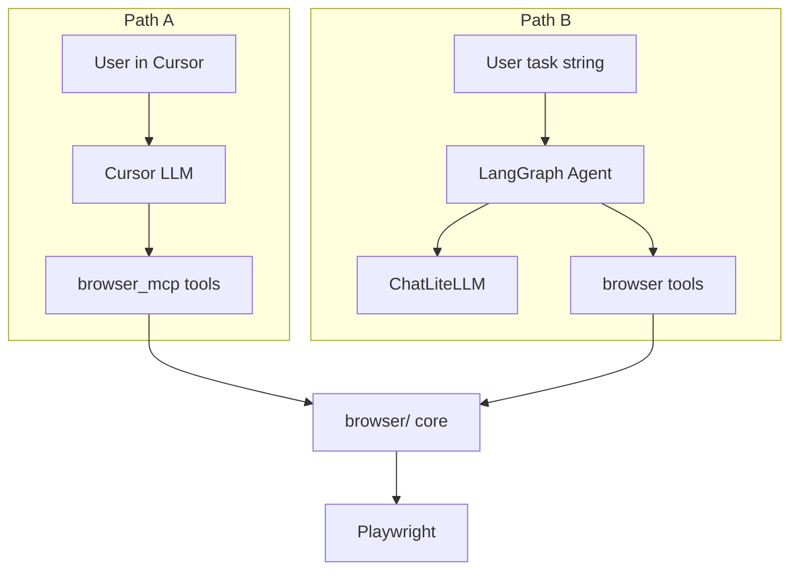
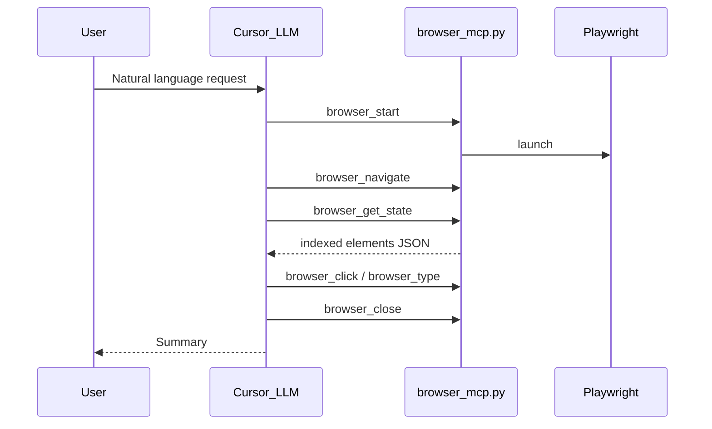
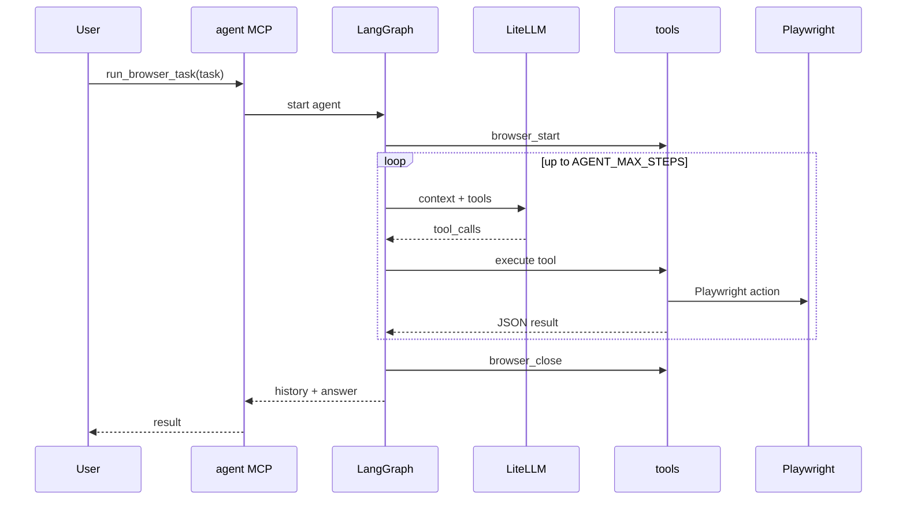
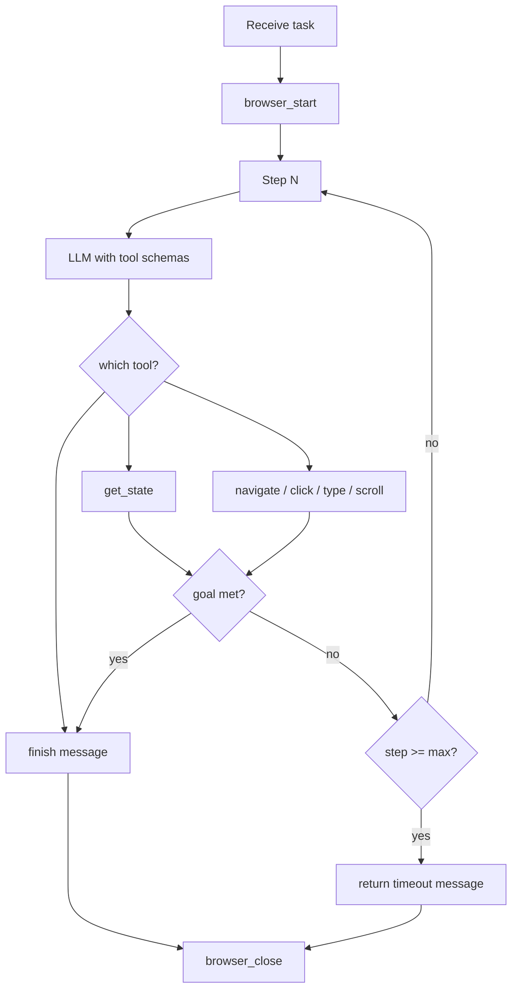
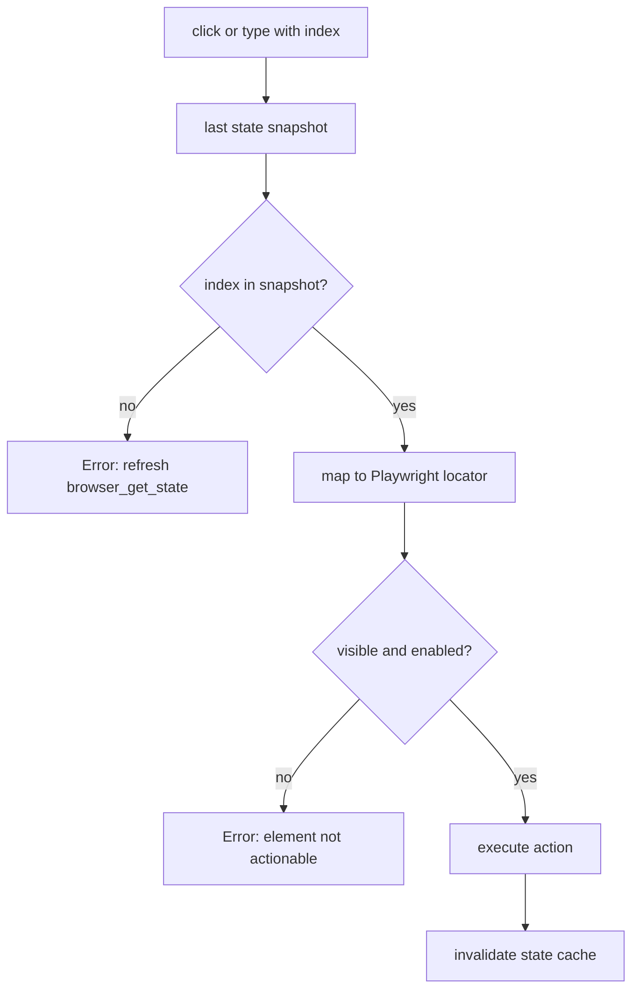
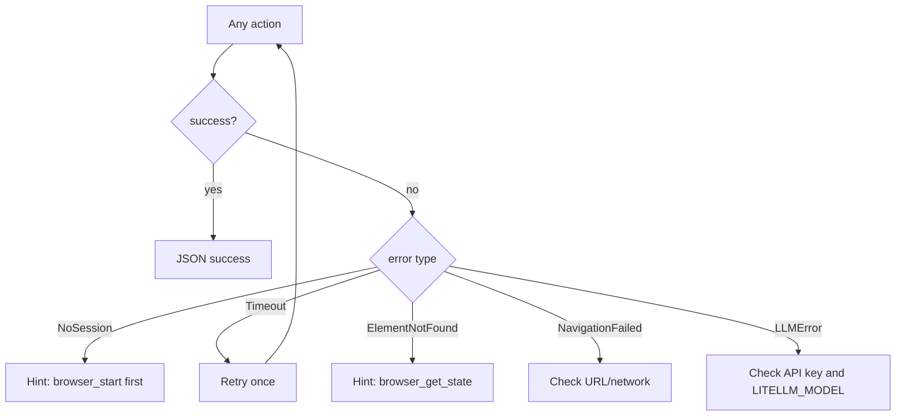
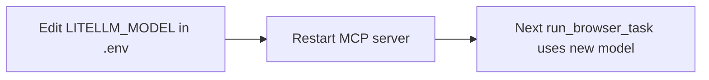
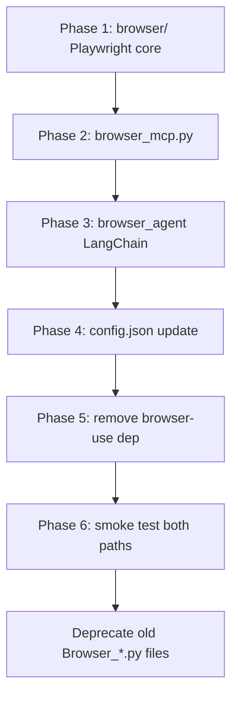
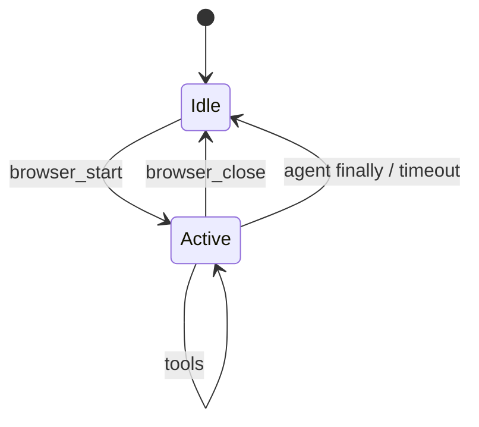

# Custom MCP Browser Automation — Flow Logic Plan

**Version:** 1.0  
**Date:** June 2026  
**Purpose:** Operational flows — how users, Cursor, and the custom agent interact with the browser

---

## 1. Flow Overview

Two paths, one browser core:

| Path | Who decides actions | Entry point | Best for |
|------|---------------------|-------------|----------|
| **A — Cursor orchestrates** | Cursor's built-in LLM | `browser_mcp.py` tools | Interactive chat, step visibility |
| **B — Custom agent** | Your LangChain + LiteLLM agent | `run_browser_task` or CLI | Full tasks, provider choice, automation |

---

## 2. Path A — Cursor Orchestrated Flow

### User story

> "I chat in Cursor. Cursor opens Chrome, reads the page, clicks and types for me."

### Sequence

### Cursor decision logic (implicit)

Cursor's model follows this pattern without custom code:

1. **Start** — if no session, call `browser_start`
2. **Navigate** — go to target URL
3. **Observe** — `browser_get_state` or `browser_get_content`
4. **Act** — pick element **index** from state JSON, call click/type
5. **Re-observe** — after each action that changes the page
6. **Close** — `browser_close` when done

### Example conversation flow

| Step | User / Cursor action | MCP tool |
|------|----------------------|----------|
| 1 | "Open browser and go to google.com" | `browser_start`, `browser_navigate` |
| 2 | Cursor reads page | `browser_get_state` |
| 3 | "Click the search box" | `browser_click` index from state |
| 4 | "Type Playwright tutorial" | `browser_type` |
| 5 | "Press Enter" (if needed) | `browser_execute_javascript` or click button index |
| 6 | Done | `browser_close` |

---

## 3. Path B — Custom Agent Flow

### User story

> "I give one task sentence. My agent runs until done using any LLM I configure."

### Sequence

### Agent decision rules (system prompt)

| Rule | Rationale |
|------|-----------|
| Always `browser_get_state` before click/type | Indexes come from latest snapshot |
| Do not guess element indices | Prevents wrong clicks |
| Re-fetch state after navigation or major click | DOM may have changed |
| Stop when task objective is met | Avoid infinite loops |
| Max 25 steps then stop with partial result | Safety guard |
| Always `browser_close` in finally | No orphaned Chrome processes |

### Agent loop diagram

---

## 4. Element Index Resolution Flow

Both paths use the same index model.

**Important:** Indexes are **not stable across navigations**. Always get fresh state after `browser_navigate` or significant DOM changes.

---

## 5. Error Handling Flow

### User-facing error messages

| Code | Message | Recovery |
|------|---------|----------|
| `NO_SESSION` | No active browser session | Call `browser_start` |
| `ELEMENT_NOT_FOUND` | Index not in snapshot | Call `browser_get_state` |
| `NAVIGATION_FAILED` | URL load failed | Check URL, retry navigate |
| `MAX_STEPS` | Agent step limit reached | Simplify task or increase limit |
| `LLM_ERROR` | Model call failed | Check keys and model string |

---

## 6. Provider Switch Flow (LiteLLM)

No code change required to switch LLM:

Examples:
- `openai/gpt-4o` → needs `OPENAI_API_KEY`
- `anthropic/claude-sonnet-4-6` → needs `ANTHROPIC_API_KEY`
- `ollama/llama3` → local Ollama running

Optional per-task override: `run_browser_task(task, model="anthropic/claude-sonnet-4-6")`

---

## 7. Migration Flow (browser-use → owned stack)

### What gets removed

- `browser-use` package
- `BROWSER_USE_API_KEY` from config
- `ChatBrowserUse` from `Browser_Agent.py`

### What stays conceptually the same

- Tool names (`browser_start`, `browser_click`, etc.)
- Indexed element interaction model
- MCP stdio transport via `uv run`

---

## 8. Typical Use Cases

### Use case 1 — Research in Cursor (Path A)

**Flow:** User asks Cursor → Cursor uses MCP tools one at a time → user sees each step.

**Best when:** You want control, visibility, or to correct mid-task.

### Use case 2 — One-shot automation (Path B)

**Flow:** User sends single task → agent runs full loop → returns summary.

**Best when:** Repetitive tasks, scripts, or non-Cursor clients.

### Use case 3 — Multi-provider testing (Path B)

**Flow:** Same task, change `LITELLM_MODEL` → compare results.

**Best when:** Evaluating which model handles web tasks best.

---

## 9. Session Lifecycle (shared)

**Rule:** Only one active session per MCP process. Second `browser_start` returns error.

---

## Appendix — LaTeX PDF build

For PDF matching Renewal-Upsell-Advisor style:

1. Copy this content into `flow-logic.tex`
2. Generate PNGs from `diagrams/IMAGE_PROMPTS.md`
3. Run `flow-logic/build.ps1`
