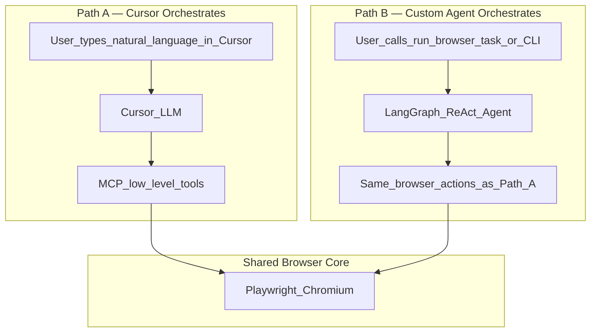
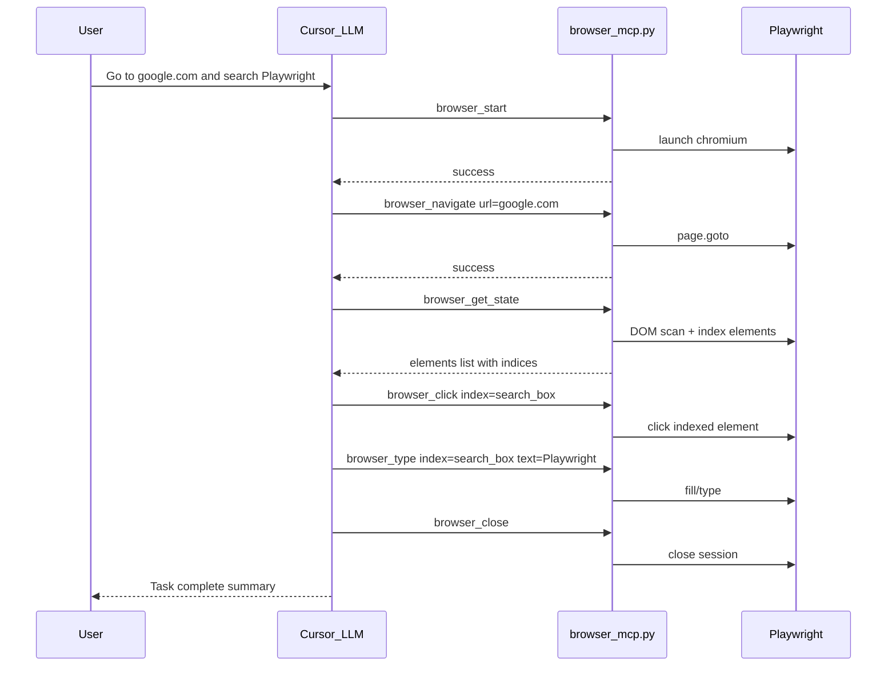
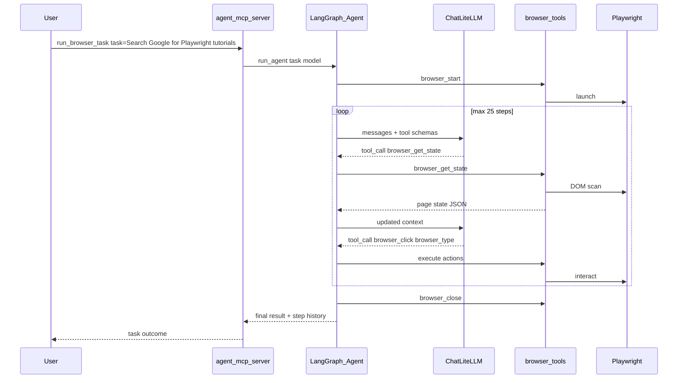
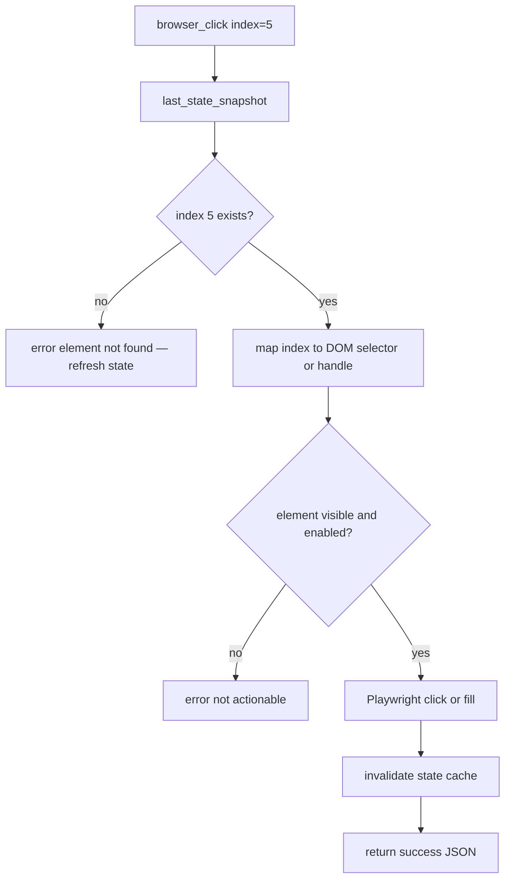
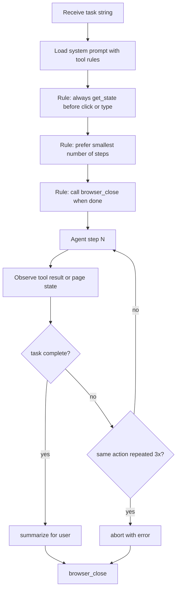
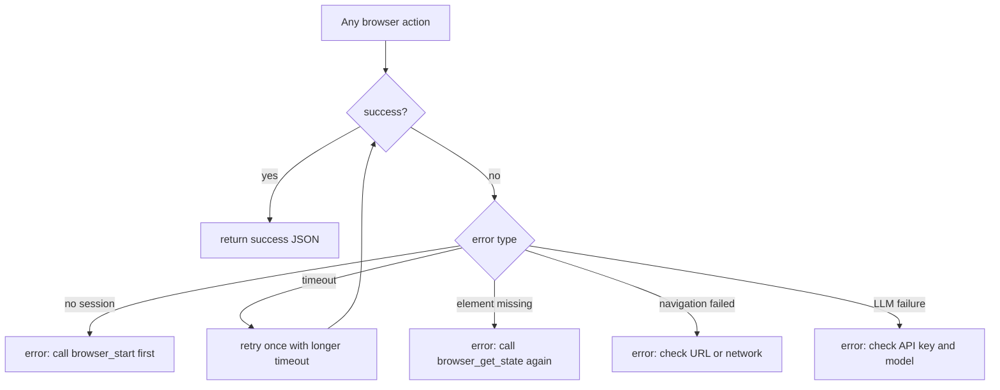
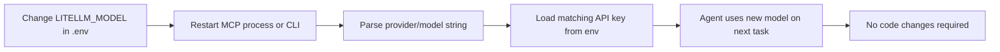
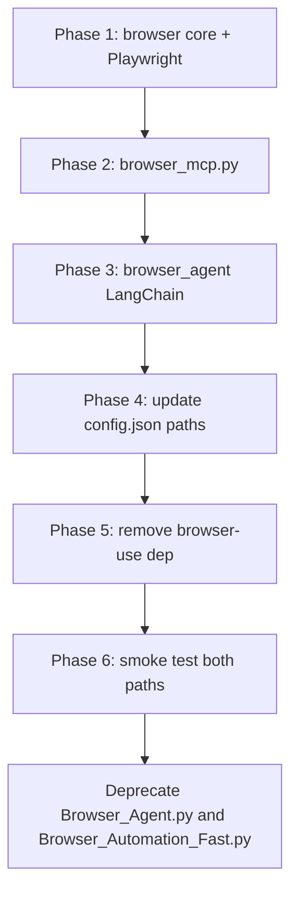

# Diagram Source Specifications — Flow Logic

Operational and business-flow diagrams for how users and agents interact with the browser system.

---

## 1. Dual-Path Overview (who decides what)

**Rule:** Path A = Cursor's model is the brain. Path B = your LiteLLM-backed agent is the brain. Both use identical browser primitives.

---

## 2. Path A — Cursor Step-by-Step Flow

---

## 3. Path B — Custom Agent Task Flow

---

## 4. Element Index Resolution Flow

---

## 5. Agent Decision Loop (flow logic)

---

## 6. Error Handling Flow

---

## 7. Provider Switch Flow (LiteLLM)

---

## 8. Migration Flow (browser-use → owned stack)

---

## PNG target files

| Concept | PNG File |
|---------|----------|
| Dual-Path Overview | `images/cbm-flow-dual-path.png` |
| Path A Cursor Sequence | `images/cbm-flow-cursor-sequence.png` |
| Path B Agent Sequence | `images/cbm-flow-agent-sequence.png` |
| Element Index Resolution | `images/cbm-flow-element-index.png` |
| Agent Decision Loop | `images/cbm-flow-agent-decisions.png` |
| Error Handling | `images/cbm-flow-error-handling.png` |
| Provider Switch | `images/cbm-flow-provider-switch.png` |
| Migration Phases | `images/cbm-flow-migration.png` |
