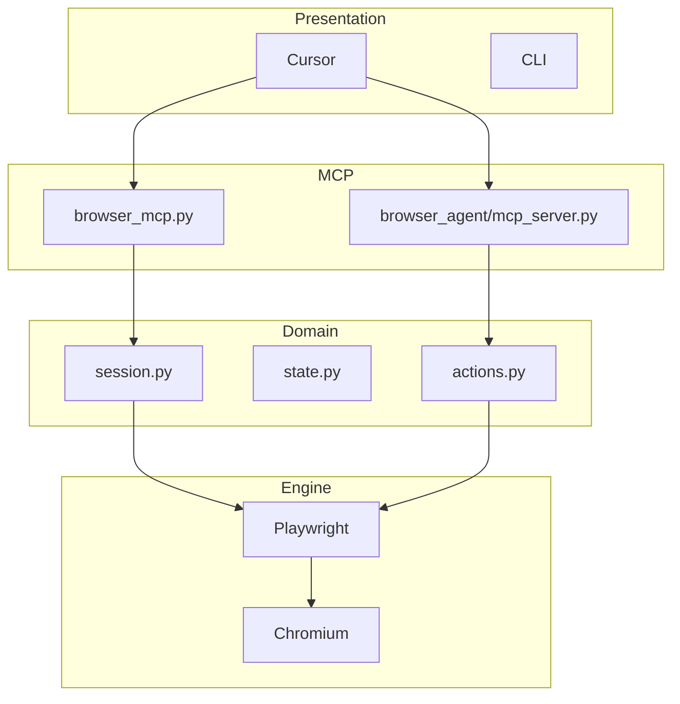

# Custom MCP Browser Automation — Technical Architecture Plan

**Version:** 1.0  
**Date:** June 2026  
**Scope:** Replace browser-use with owned Playwright + MCP + LangChain + LiteLLM stack

---

## 1. Executive Technical Summary

Build a **self-owned** browser automation platform for Custom_MCP with:

1. **Playwright** as the sole browser engine (no browser-use SDK, no `BROWSER_USE_API_KEY`)
2. **MCP server** exposing low-level browser tools to Cursor
3. **Custom LangGraph agent** using **langchain-litellm** for any LLM provider

Both entry points share one `browser/` core module.

### Technology stack

| Layer | Technology | Role |
|-------|------------|------|
| Browser engine | Playwright (`playwright.async_api`) | Launch Chromium, navigate, interact |
| MCP protocol | `mcp` + `fastmcp` | Expose tools to Cursor via stdio |
| Agent orchestration | LangGraph `create_react_agent` | ReAct loop until task complete |
| Multi-provider LLM | `langchain-litellm` + `litellm` | OpenAI, Anthropic, Ollama, Groq, etc. |
| Config | `python-dotenv` + JSON schemas | API keys, model, browser options |

### Non-functional targets

| Requirement | Target |
|-------------|--------|
| Browser cold start | < 3 s (local Chromium) |
| `browser_get_state` (cached) | < 100 ms |
| `browser_get_state` (fresh) | < 1.5 s |
| Agent max steps | 25 (configurable) |
| Session cleanup | Always in `finally` block |
| Vendor lock-in | None — no browser-use API |

---

## 2. System Context

### Current state (to replace)

| File | Problem |
|------|---------|
| `Browser_Agent.py` | Tied to `ChatBrowserUse` + `BROWSER_USE_API_KEY` |
| `Browser_Automation_Fast.py` | Uses browser-use `BrowserSession`, event bus |
| `pyproject.toml` | Depends on `browser-use>=0.10.1` |

### Target consumers

- **Cursor chat agent** — calls MCP tools step-by-step
- **Custom agent MCP** — single `run_browser_task(task)` tool
- **CLI** (optional) — `python -m browser_agent.agent "task"`

---

## 3. Platform Architecture

See diagram: `diagrams/README.md` § Platform Architecture

### Four logical layers

1. **Presentation** — Cursor IDE, CLI
2. **MCP servers** — `browser_mcp.py`, `browser_agent/mcp_server.py`
3. **Domain** — `browser/session.py`, `state.py`, `actions.py`, `browser_agent/*`
4. **Engine** — Playwright → Chromium



---

## 4. Package Layout

```
D:/Custom_MCP/
  browser/
    __init__.py
    config.py           # env: headless, timeout, cache TTL
    session.py          # Playwright lifecycle
    state.py            # indexed DOM extraction
    actions.py          # navigate, click, type, scroll, js, screenshot
  browser_mcp.py        # MCP low-level tools
  browser_agent/
    __init__.py
    tools.py            # LangChain @tool wrappers
    agent.py            # LangGraph ReAct loop
    mcp_server.py       # run_browser_task MCP tool
  pyproject.toml
  config.json
  .env
```

---

## 5. Module Specifications

### 5.1 `browser/session.py`

**Responsibility:** Playwright browser/context/page lifecycle.

| Method | Description |
|--------|-------------|
| `start(headless: bool)` | Launch Chromium, create context + page |
| `close()` | Release browser, clear singleton |
| `get_page()` | Active `Page` or raise if no session |
| `new_tab(url?)` | Open tab, optionally navigate |
| `switch_tab(index)` | Set active page by tab index |

**State:** `Idle | Starting | Active | Closing`

### 5.2 `browser/state.py`

**Responsibility:** Build indexed interactive element list for MCP/agent.

**Algorithm:**
1. Run in-page JS to query interactive selectors (see `schemas/browser_config.example.json`)
2. Filter visible, non-zero-size elements
3. Assign stable index `0..N-1` for current snapshot
4. Store snapshot in memory for `click(index)` resolution
5. Optional base64 PNG screenshot

**Output JSON:**
```json
{
  "url": "https://example.com",
  "title": "Example",
  "element_count": 12,
  "interactive_elements": [
    {"index": 0, "tag": "input", "type": "text", "placeholder": "Search", "text": ""}
  ],
  "screenshot": null
}
```

**Cache:** TTL 2 s (configurable); invalidate on navigate/click/type.

### 5.3 `browser/actions.py`

| Function | Playwright API |
|----------|----------------|
| `navigate(url, new_tab)` | `page.goto()` |
| `click(index)` | Resolve from snapshot → `locator.click()` |
| `type_text(index, text)` | `locator.fill()` or `type()` |
| `scroll(direction, amount)` | `page.evaluate(window.scrollBy)` |
| `evaluate(script)` | `page.evaluate()` |
| `screenshot()` | `page.screenshot()` |
| `get_text_content()` | `page.inner_text('body')` |

---

## 6. MCP Server — `browser_mcp.py`

### Tools exposed to Cursor

| Tool | Input | Output |
|------|-------|--------|
| `browser_start` | `headless?: bool` | `{ success, message }` |
| `browser_close` | — | `{ success }` |
| `browser_navigate` | `url`, `new_tab?` | `{ success, url }` |
| `browser_get_state` | `include_screenshot?`, `force_refresh?` | state JSON |
| `browser_get_content` | — | `{ url, title, text_content }` |
| `browser_click` | `index` | `{ success, index }` |
| `browser_type` | `index`, `text` | `{ success, index }` |
| `browser_scroll` | `direction`, `amount` | `{ success }` |
| `browser_execute_javascript` | `script` | `{ success, result }` |

**Design rule:** No LLM inside this server. Cursor's model orchestrates.

---

## 7. Custom Agent — `browser_agent/`

### 7.1 LangChain tools (`tools.py`)

Same operations as MCP tools, wrapped as LangChain `@tool` functions returning JSON strings.

### 7.2 Agent loop (`agent.py`)

```python
from langchain_litellm import ChatLiteLLM
from langgraph.prebuilt import create_react_agent

llm = ChatLiteLLM(model=os.getenv("LITELLM_MODEL", "openai/gpt-4o"))
agent = create_react_agent(llm, tools)
```

**System prompt rules:**
- Call `browser_get_state` before any click/type
- Minimize steps
- Call `browser_close` when task is complete or on failure
- Max steps: `AGENT_MAX_STEPS` (default 25)

### 7.3 Agent MCP (`mcp_server.py`)

```python
@mcp.tool()
async def run_browser_task(task: str, model: str | None = None) -> str:
    """Run multi-step browser automation with custom LangChain agent."""
```

---

## 8. LiteLLM Multi-Provider

Model string format: `provider/model`

| Provider | Example model | Env key |
|----------|---------------|---------|
| OpenAI | `openai/gpt-4o` | `OPENAI_API_KEY` |
| Anthropic | `anthropic/claude-sonnet-4-6` | `ANTHROPIC_API_KEY` |
| Ollama | `ollama/llama3` | (local, no key) |
| Groq | `groq/llama-3.3-70b-versatile` | `GROQ_API_KEY` |

See `schemas/litellm_config.example.json` for router/fallback config (optional phase 2).

---

## 9. Dependencies

**Remove:** `browser-use`

**Add to `pyproject.toml`:**
```toml
"playwright>=1.49.0",
"langchain>=0.3.0",
"langchain-core>=0.3.0",
"langgraph>=0.2.0",
"langchain-litellm>=0.2.0",
"litellm>=1.55.0",
```

**Post-install:** `python -m playwright install chromium`

---

## 10. Environment Variables

```env
LITELLM_MODEL=openai/gpt-4o
OPENAI_API_KEY=sk-...
ANTHROPIC_API_KEY=sk-ant-...
BROWSER_HEADLESS=false
BROWSER_TIMEOUT_MS=30000
AGENT_MAX_STEPS=25
```

---

## 11. Implementation Phases

| Phase | Deliverable | Test |
|-------|-------------|------|
| 1 | `browser/` core | Unit test navigate + get_state |
| 2 | `browser_mcp.py` | Cursor calls browser_start + navigate |
| 3 | `browser_agent/` | run_browser_task completes simple search |
| 4 | Config migration | Update config.json paths to D:/Custom_MCP |
| 5 | Cleanup | Remove browser-use, deprecate old files |
| 6 | Smoke test | Both paths on same site |

---

## 12. Out of Scope (Phase 1)

- Vision/coordinate clicking (DOM index only)
- Persistent cookies/profiles across sessions
- LiteLLM Router load balancing
- Anti-bot stealth plugins

---

## Appendix — LaTeX PDF build

When ready for PDF output (matching Renewal-Upsell-Advisor style):

1. Copy this content into `tech-plan.tex`
2. Generate PNGs from `diagrams/IMAGE_PROMPTS.md`
3. Run `tech-plan/build.ps1` (requires `pdflatex`)
