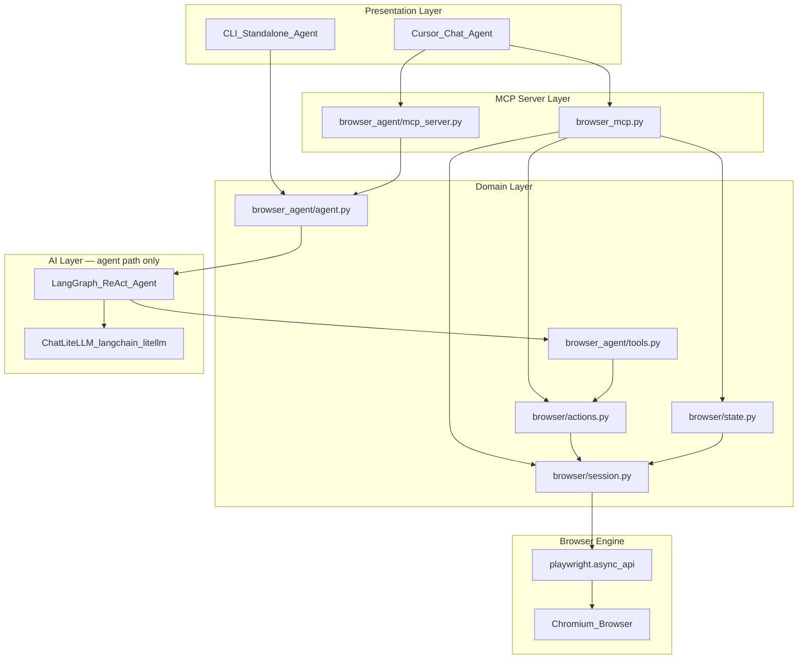
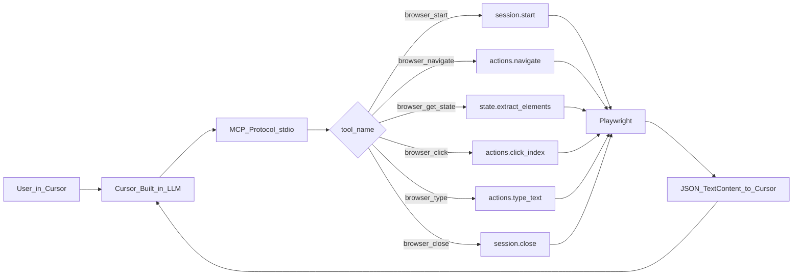
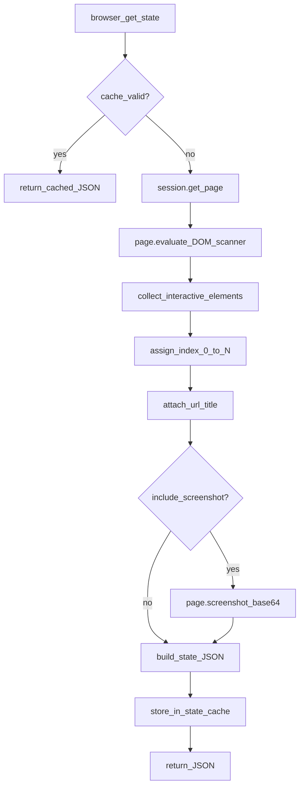
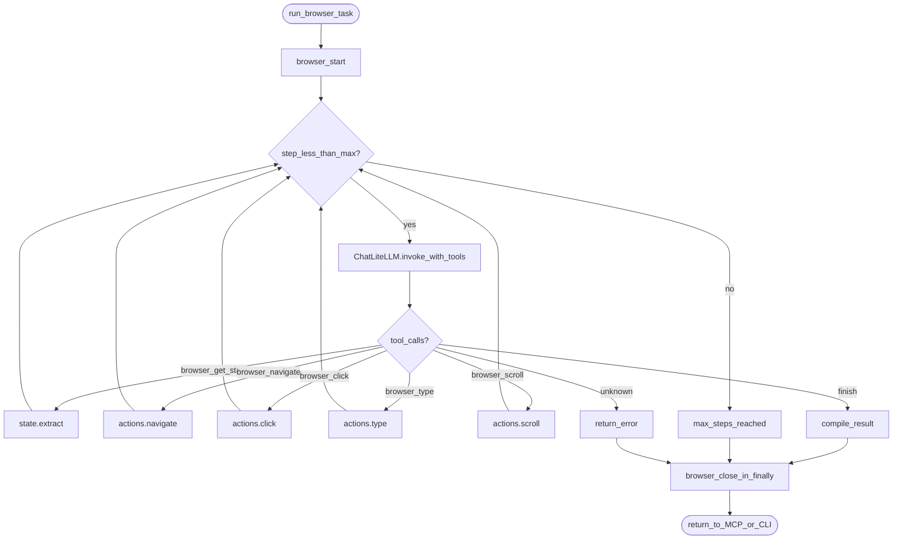
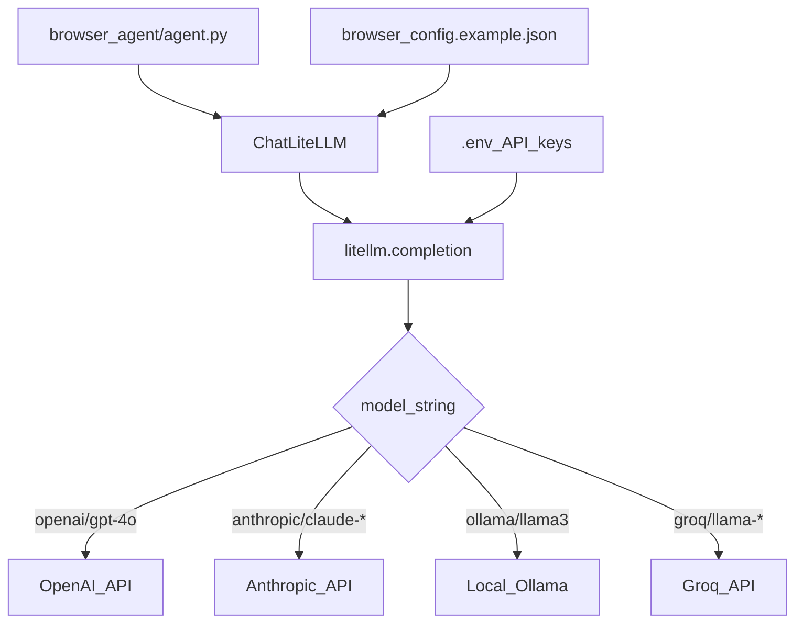
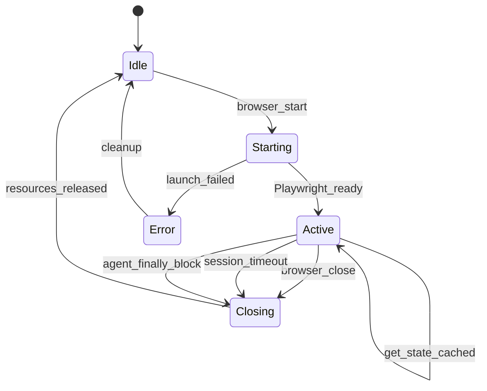
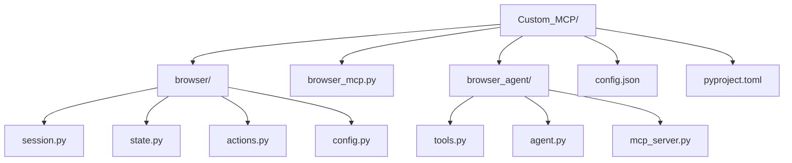
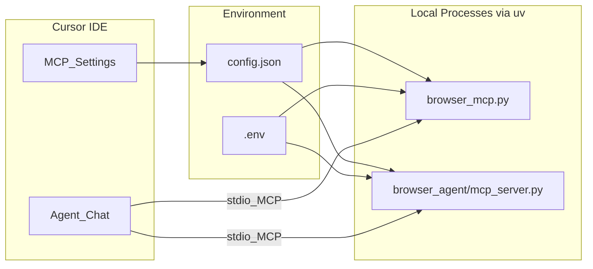

# Diagram Source Specifications — Technical Plan

Mermaid source blocks for maintainability. Regenerate PNGs via `IMAGE_PROMPTS.md` when diagrams change.

Brand colors: navy `#0c3472`, accent `#c8d7eb`.

---

## 1. Platform Architecture (four layers)

---

## 2. MCP Tool Data Flow

---

## 3. Page State Extraction Pipeline

---

## 4. LangGraph ReAct Agent Loop

---

## 5. LiteLLM Multi-Provider Router

---

## 6. Session Lifecycle

---

## 7. Package Layout

---

## 8. Deployment / MCP Wiring

---

## PNG target files

| Mermaid / Concept | PNG File |
|-------------------|----------|
| Platform Architecture | `images/cbm-tech-platform-architecture.png` |
| MCP Tool Data Flow | `images/cbm-mcp-tool-data-flow.png` |
| Page State Extraction | `images/cbm-page-state-pipeline.png` |
| LangGraph ReAct Loop | `images/cbm-langgraph-react-agent.png` |
| LiteLLM Multi-Provider | `images/cbm-litellm-providers.png` |
| Session Lifecycle | `images/cbm-session-lifecycle.png` |
| Package Layout | `images/cbm-package-layout.png` |
| MCP Deployment Wiring | `images/cbm-mcp-deployment.png` |
